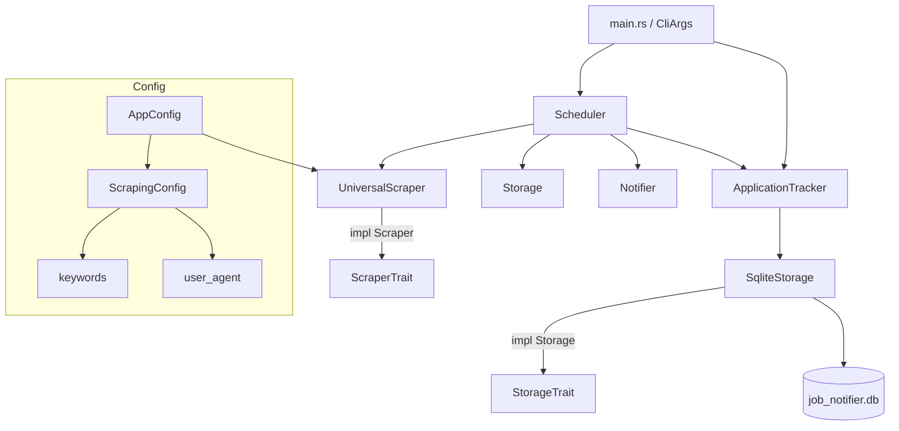

# Design Document: job-notifier-enhanced

## Overview

Доработка проекта `job-notifier` включает два независимых компонента:

1. **UniversalScraper** — универсальный HTML-скрейпер, работающий с произвольными сайтами через поиск ключевых слов в `div`-элементах, без сайт-специфичной логики.
2. **Application Tracker** — подсистема отслеживания поданных заявок с хранением в SQLite, CLI-управлением и уведомлениями об истечении дедлайна.

Оба компонента встраиваются в существующую архитектуру без изменения публичных трейтов `Scraper`, `Storage`, `Notifier`, `Filter`.

---

## Architecture



Поток данных при плановом запуске:
1. `Scheduler::run_once` → `UniversalScraper::scrape` → фильтрация → дедупликация → `Notifier::notify` (новые вакансии)
2. `Scheduler::run_once` → `Storage::get_deadline_applications` → `Notifier::notify_deadlines` (истёкшие дедлайны)

---

## Components and Interfaces

### UniversalScraper (`src/scraper/universal.rs`)

```rust
pub struct UniversalScraper {
    keywords: Vec<String>,
    user_agent: Option<String>,
    client: reqwest::Client,
}

impl UniversalScraper {
    pub fn new(keywords: Vec<String>, user_agent: Option<String>) -> Self;
    fn extract_jobs(&self, html: &str, base_url: &str) -> Vec<Job>;
    fn resolve_url(href: &str, base_url: &str) -> String;
}

#[async_trait]
impl Scraper for UniversalScraper { ... }
```

Алгоритм `extract_jobs`:
- Парсит HTML через `scraper::Html::parse_document`
- Итерирует по всем `div`-элементам
- Для каждого `div` собирает весь текст (`element.text().collect::<String>()`)
- Если текст содержит хотя бы одно ключевое слово (case-insensitive) — извлекает первый `<a href>` как URL вакансии и первую текстовую строку как заголовок
- Вызывает `detect_grade` (перенесена из `HhScraper` в отдельную функцию `src/scraper/grade.rs`)
- Относительные URL преобразует через `resolve_url`

### ApplicationTracker (`src/tracker/mod.rs`)

Тонкий фасад над `Storage`, инкапсулирующий бизнес-логику работы с заявками.

```rust
pub struct ApplicationTracker {
    storage: Arc<dyn Storage>,
}

impl ApplicationTracker {
    pub async fn add(&self, cmd: AddApplicationCmd) -> Result<Application, StorageError>;
    pub async fn list(&self) -> Result<Vec<Application>, StorageError>;
    pub async fn update_status(&self, id: &str, status: ApplicationStatus) -> Result<(), StorageError>;
    pub async fn delete(&self, id: &str) -> Result<(), StorageError>;
    pub async fn get_due_today(&self) -> Result<Vec<Application>, StorageError>;
}
```

### Расширение трейта Storage

Новые методы добавляются в `src/storage/mod.rs`:

```rust
async fn add_application(&self, app: &Application) -> Result<(), StorageError>;
async fn list_applications(&self) -> Result<Vec<Application>, StorageError>;
async fn update_application_status(&self, id: &str, status: &ApplicationStatus) -> Result<(), StorageError>;
async fn delete_application(&self, id: &str) -> Result<(), StorageError>;
async fn get_deadline_applications(&self) -> Result<Vec<Application>, StorageError>;
```

### Расширение Notifier

Добавляется метод в трейт `Notifier`:

```rust
async fn notify_deadlines(&self, apps: &[Application]) -> Result<(), NotifierError>;
```

`ConsoleNotifier` реализует его, выводя отдельный блок с заголовком "Deadline reminders".

### Расширение AppConfig

```toml
[scraping]
urls = [...]
interval_minutes = 1440
timeout_secs = 10
keywords = ["rust", "backend"]   # новое поле, default = []
user_agent = "Mozilla/5.0 ..."   # новое поле, optional
```

```rust
pub struct ScrapingConfig {
    pub urls: Vec<String>,
    pub interval_minutes: u64,
    pub timeout_secs: u64,
    pub keywords: Vec<String>,          // #[serde(default)]
    pub user_agent: Option<String>,     // #[serde(default)]
}
```

### CLI расширение (`src/main.rs`)

Новые подкоманды через `clap` subcommands:

```
job-notifier add-application --company <name> --position <pos> [--reply-days <n>] [--notes <text>]
job-notifier list-applications
job-notifier update-status --id <id> --status <status>
job-notifier delete-application --id <id>
```

---

## Data Models

### Application (`src/domain/application.rs`)

```rust
#[derive(Debug, Clone, Serialize, Deserialize, PartialEq, Eq)]
pub enum ApplicationStatus {
    Submitted,
    InReview,
    Rejected,
    OfferReceived,
    Withdrawn,
}

impl ApplicationStatus {
    pub fn is_terminal(&self) -> bool {
        matches!(self, Self::Rejected | Self::OfferReceived | Self::Withdrawn)
    }
    
    pub fn from_str_cli(s: &str) -> Result<Self, String>;  // парсинг из CLI
}

#[derive(Debug, Clone, Serialize, Deserialize)]
pub struct Application {
    pub id: String,                    // UUID v4
    pub company: String,
    pub position: String,
    pub applied_at: NaiveDate,
    pub expected_reply_days: u32,      // default: 21
    pub status: ApplicationStatus,
    pub notes: Option<String>,
}

impl Application {
    pub fn deadline(&self) -> NaiveDate {
        self.applied_at + chrono::Duration::days(self.expected_reply_days as i64)
    }
    
    pub fn is_due_today(&self) -> bool {
        self.deadline() == chrono::Local::now().date_naive()
            && !self.status.is_terminal()
    }
}
```

### Схема таблицы `applications` (SQLite)

```sql
CREATE TABLE IF NOT EXISTS applications (
    id TEXT PRIMARY KEY,
    company TEXT NOT NULL,
    position TEXT NOT NULL,
    applied_at DATE NOT NULL,
    expected_reply_days INTEGER NOT NULL DEFAULT 21,
    status TEXT NOT NULL DEFAULT 'Submitted',
    notes TEXT,
    created_at DATETIME DEFAULT CURRENT_TIMESTAMP
);

CREATE INDEX IF NOT EXISTS idx_applications_status ON applications(status);
CREATE INDEX IF NOT EXISTS idx_applications_applied_at ON applications(applied_at DESC);
```

### AddApplicationCmd

```rust
pub struct AddApplicationCmd {
    pub company: String,
    pub position: String,
    pub reply_days: Option<u32>,
    pub notes: Option<String>,
}
```

---

## Correctness Properties

*A property is a characteristic or behavior that should hold true across all valid executions of a system — essentially, a formal statement about what the system should do. Properties serve as the bridge between human-readable specifications and machine-verifiable correctness guarantees.*

### Property 1: Фильтрация div по ключевым словам

*For any* HTML-документа и непустого списка ключевых слов, все объекты `Job`, возвращённые `UniversalScraper`, должны происходить из `div`-элементов, текст которых содержит хотя бы одно ключевое слово (без учёта регистра).

**Validates: Requirements 1.2, 2.4**

### Property 2: Извлечение полей из совпадающего div

*For any* `div`-элемента, совпадающего с ключевыми словами, извлечённый `Job` должен иметь непустой `title` и `url`, начинающийся с `http`.

**Validates: Requirements 1.3**

### Property 3: Преобразование относительного URL в абсолютный

*For any* базового URL страницы и относительного `href`, функция `resolve_url` должна возвращать строку, начинающуюся с origin базового URL.

**Validates: Requirements 1.4**

### Property 4: Определение грейда из заголовка

*For any* строки заголовка вакансии, содержащей одно из ключевых слов грейда (junior, senior, middle, lead, intern, principal, staff и их русские эквиваленты), функция `detect_grade` должна возвращать соответствующий `JobGrade`.

**Validates: Requirements 1.8**

### Property 5: Десериализация keywords из TOML

*For any* списка строк `keywords` в секции `[scraping]` файла TOML, `AppConfig::load_from_file` должна десериализовать их в `Vec<String>` без потерь.

**Validates: Requirements 2.1**

### Property 6: Round-trip добавления Application

*For any* корректного `Application`, после вызова `add_application` вызов `list_applications` должен возвращать список, содержащий эту заявку с теми же полями.

**Validates: Requirements 3.1**

### Property 7: Сортировка списка заявок

*For any* набора заявок с различными датами `applied_at`, `list_applications` должна возвращать их в порядке убывания `applied_at`.

**Validates: Requirements 3.2**

### Property 8: Обновление статуса заявки

*For any* существующей заявки и любого допустимого `ApplicationStatus`, после вызова `update_application_status` вызов `list_applications` должен возвращать эту заявку с обновлённым статусом.

**Validates: Requirements 3.3**

### Property 9: Удаление заявки

*For any* существующей заявки, после вызова `delete_application` вызов `list_applications` не должен содержать заявку с этим `id`.

**Validates: Requirements 3.4**

### Property 10: Получение заявок с дедлайном сегодня

*For any* набора заявок, `get_deadline_applications` должна возвращать только те заявки, у которых `deadline() == today` и статус не является терминальным (`Rejected`, `OfferReceived`, `Withdrawn`).

**Validates: Requirements 3.5, 5.4**

### Property 11: Создание заявки через add с правильными полями

*For any* значений `company`, `position` и опционального `reply_days`, `ApplicationTracker::add` должен создавать заявку со статусом `Submitted`, `expected_reply_days` равным переданному значению (или 21 по умолчанию), и сохранять `notes` без изменений.

**Validates: Requirements 4.1, 4.2, 4.3**

### Property 12: Форматирование строки таблицы заявок

*For any* объекта `Application`, строка его табличного представления должна содержать `id`, `company`, `position`, строковое представление `applied_at`, строковое представление `deadline()` и строковое представление `status`.

**Validates: Requirements 4.4**

### Property 13: Уведомление о дедлайне содержит обязательные поля

*For any* объекта `Application`, вывод `ConsoleNotifier::notify_deadlines` должен содержать `company`, `position` и строковое представление `deadline()`.

**Validates: Requirements 5.2**

---

## Error Handling

| Ситуация | Ошибка | Поведение |
|---|---|---|
| HTTP-запрос завершился с ошибкой | `ScraperError::Network` | Логируется, скрейпинг URL пропускается |
| HTML не содержит совпадений | — | Возвращается пустой `Vec<Job>` |
| `Application` с указанным `id` не найден | `StorageError::NotFound` | Возвращается ошибка, CLI выводит сообщение |
| Недопустимое значение `--status` в CLI | — | CLI выводит список допустимых значений и завершается с кодом 1 |
| Ошибка миграции БД | `StorageError::Migration` | Паника при старте (критическая ошибка инфраструктуры) |
| Ошибка сериализации/десериализации | `StorageError::Serialization` / `Deserialization` | Возвращается ошибка |

Новый вариант `StorageError::NotFound` добавляется в `src/errors.rs`:

```rust
#[error("record not found: {0}")]
NotFound(String),
```

---

## Testing Strategy

### Подход

Используется двойная стратегия тестирования:
- **Unit-тесты** — конкретные примеры, граничные случаи, интеграционные точки
- **Property-based тесты** — универсальные свойства на случайных входных данных

Библиотека для property-based тестирования: [`proptest`](https://github.com/proptest-rs/proptest) (crate `proptest = "1"`).

Каждый property-тест запускается минимум **100 итераций** (настройка через `ProptestConfig::with_cases(100)`).

### Unit-тесты

- `UniversalScraper::extract_jobs` с пустым HTML → пустой список (1.6)
- `UniversalScraper::extract_jobs` с HTML без совпадений → пустой список (1.6)
- `AppConfig::load_from_file` без поля `keywords` → `keywords == []` (2.2)
- `SqliteStorage::add_application` + `list_applications` на in-memory SQLite (3.7)
- `ApplicationStatus::from_str_cli` с недопустимым значением → `Err` (4.6)
- `ConsoleNotifier::notify_deadlines` и `notify` производят разный вывод (5.3)
- `Application::is_due_today` с терминальным статусом → `false` (5.4)

### Property-тесты

Каждый property-тест аннотирован тегом:
`// Feature: job-notifier-enhanced, Property N: <текст свойства>`

| Тест | Property | Библиотека |
|---|---|---|
| Фильтрация div по ключевым словам | P1 | proptest |
| Извлечение полей из совпадающего div | P2 | proptest |
| Преобразование относительного URL | P3 | proptest |
| Определение грейда из заголовка | P4 | proptest |
| Десериализация keywords из TOML | P5 | proptest |
| Round-trip добавления Application | P6 | proptest |
| Сортировка списка заявок | P7 | proptest |
| Обновление статуса заявки | P8 | proptest |
| Удаление заявки | P9 | proptest |
| Получение заявок с дедлайном сегодня | P10 | proptest |
| Создание заявки с правильными полями | P11 | proptest |
| Форматирование строки таблицы | P12 | proptest |
| Уведомление о дедлайне содержит поля | P13 | proptest |

Property-тесты для `Storage` используют in-memory SQLite (`sqlite::memory:`).
Property-тесты для `UniversalScraper` используют синтетически сгенерированный HTML без реальных HTTP-запросов (тестируется только `extract_jobs`).
